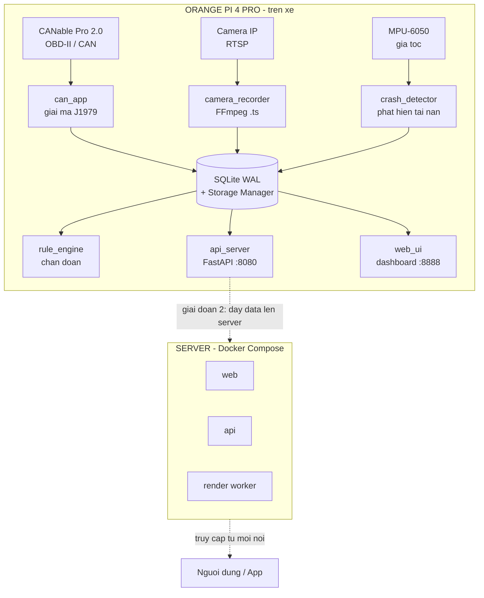

<div align="center">

# 🚗 VDR Telemetry System — BK-AutoBlackBox

**Hộp đen ô tô thông minh: ghi vết hành trình, chẩn đoán sức khỏe xe & phát hiện tai nạn thời gian thực**
*Intelligent automotive black box: trip logging, vehicle health diagnostics & real-time crash detection*


-FF6600)


</div>

---

## 📖 Giới thiệu · Overview

**VN:** VDR (Vehicle Data Recorder) là hệ thống hộp đen ô tô chạy trên máy tính nhúng, đọc dữ liệu động cơ qua chuẩn OBD-II/CAN Bus, đồng bộ với camera hành trình, phát hiện tai nạn và cảnh báo bảo dưỡng dự đoán.

**EN:** VDR is an embedded automotive black-box system. It reads engine data via OBD-II/CAN Bus, syncs with a dashcam, detects accidents, and provides predictive maintenance alerts.

> ⚡ **Điểm khác biệt:** Không chỉ quay video như dashcam thường — hệ thống ghi **video + dữ liệu động cơ đồng bộ theo thời gian**, tạo bằng chứng tai nạn có cả tốc độ/vòng tua/chân ga tại thời điểm va chạm.

---

## ✨ Tính năng nổi bật · Key Features

| Tính năng | Mô tả |
|-----------|-------|
| 🎧 **Đọc OBD-II / CAN Bus** | Giải mã trực tiếp chuẩn SAE J1979 ở cấp Byte (không dùng wrapper), độ trễ thấp. 7 thông số: tốc độ, vòng tua, chân ga, nhiệt nước, nhiên liệu, MAF, nhiệt khí nạp |
| 📹 **Camera HUD đồng bộ** | Ghi RTSP cuốn chiếu + render HUD đè lên video, khớp chính xác thời gian thật từng frame (dùng PTS, không phụ thuộc fps) |
| 🚨 **Phát hiện tai nạn** | Cảm biến gia tốc (MPU-6050) + xác nhận chéo OBD (sụt tốc đột ngột). Tự động cắt video bằng chứng + cảnh báo |
| 🔧 **Bảo dưỡng dự đoán** | Mann-Kendall + Sen's slope phát hiện xu hướng bất thường, cảnh báo trước khi hỏng |
| 📱 **App Android + Push** | App WebView + Firebase Cloud Messaging — nhận cảnh báo realtime kể cả khi app đóng |
| 🛡️ **Tự hiệu chỉnh** | Module auto-calibration: tự dò phần cứng (MPU/camera/OBD), tự kiểm tra & hiệu chỉnh thông số lúc khởi động |
| 🌐 **Dashboard web** | Giao diện realtime: gauge, biểu đồ, lịch sử tai nạn (video bằng chứng), cảnh báo bảo dưỡng |
| 🐳 **Sẵn sàng triển khai** | Đóng gói Docker Compose (web + api + render) cho server |

---

## 🏗️ Kiến trúc hệ thống · Architecture



> 💡 Không có phần cứng? Đổi `OPERATION_MODE = "SIMULATION"` trong `config.py` để chạy giả lập trên laptop.

**Triển khai server (Docker):**
```bash
docker compose -f deploy/docker-compose.yml up -d --build
```

---

## 🗺️ Lộ trình · Roadmap

- [x] Đọc OBD-II/CAN + camera HUD đồng bộ
- [x] Chẩn đoán + bảo dưỡng dự đoán (Mann-Kendall)
- [x] Phát hiện tai nạn + video bằng chứng
- [x] App Android + push notification (FCM)
- [x] Tự hiệu chỉnh phần cứng (auto-calibration)
- [x] Đóng gói Docker Compose
- [ ] Đồng bộ Pi → server (MQTT store-and-forward)
- [ ] Render video bằng chứng phía server
- [ ] Truy cập từ xa qua internet (SIM 4G / VPS)

---

<div align="center">
</div>
