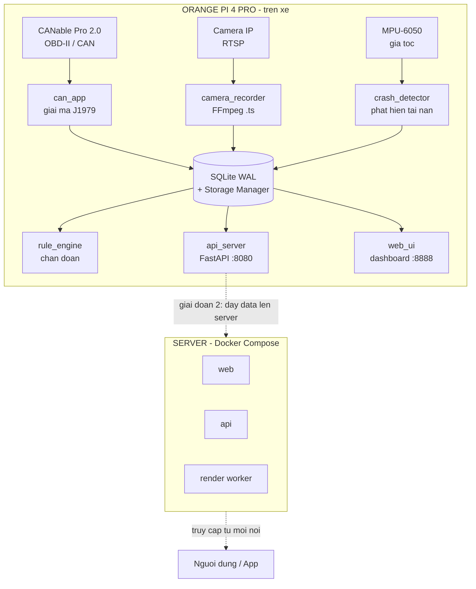

<div align="center">

# 🚗 VDR Telemetry System — BK-AutoBlackBox

**Hộp đen ô tô thông minh: ghi vết hành trình, chẩn đoán sức khỏe xe & phát hiện tai nạn thời gian thực**
*Intelligent automotive black box: trip logging, vehicle health diagnostics & real-time crash detection*


-FF6600)


</div>

---

## 📖 Giới thiệu · Overview

**VN:** VDR (Vehicle Data Recorder) là hệ thống hộp đen ô tô chạy trên máy tính nhúng, đọc dữ liệu động cơ qua chuẩn OBD-II/CAN Bus, đồng bộ với camera hành trình, phát hiện tai nạn và cảnh báo bảo dưỡng dự đoán.

**EN:** VDR is an embedded automotive black-box system. It reads engine data via OBD-II/CAN Bus, syncs with a dashcam, detects accidents, and provides predictive maintenance alerts.

> ⚡ **Điểm khác biệt:** Không chỉ quay video như dashcam thường — hệ thống ghi **video + dữ liệu động cơ đồng bộ theo thời gian**, tạo bằng chứng tai nạn có cả tốc độ/vòng tua/chân ga tại thời điểm va chạm.

---

## ✨ Tính năng nổi bật · Key Features

| Tính năng | Mô tả |
|-----------|-------|
| 🎧 **Đọc OBD-II / CAN Bus** | Giải mã trực tiếp chuẩn SAE J1979 ở cấp Byte (không dùng wrapper), độ trễ thấp. 7 thông số: tốc độ, vòng tua, chân ga, nhiệt nước, nhiên liệu, MAF, nhiệt khí nạp |
| 📹 **Camera HUD đồng bộ** | Ghi RTSP cuốn chiếu + render HUD đè lên video, khớp chính xác thời gian thật từng frame (dùng PTS, không phụ thuộc fps) |
| 🚨 **Phát hiện tai nạn** | Cảm biến gia tốc (MPU-6050) + xác nhận chéo OBD (sụt tốc đột ngột). Tự động cắt video bằng chứng + cảnh báo |
| 🔧 **Bảo dưỡng dự đoán** | Mann-Kendall + Sen's slope phát hiện xu hướng bất thường, cảnh báo trước khi hỏng |
| 📱 **App Android + Push** | App WebView + Firebase Cloud Messaging — nhận cảnh báo realtime kể cả khi app đóng |
| 🛡️ **Tự hiệu chỉnh** | Module auto-calibration: tự dò phần cứng (MPU/camera/OBD), tự kiểm tra & hiệu chỉnh thông số lúc khởi động |
| 🌐 **Dashboard web** | Giao diện realtime: gauge, biểu đồ, lịch sử tai nạn (video bằng chứng), cảnh báo bảo dưỡng |
| 🐳 **Sẵn sàng triển khai** | Đóng gói Docker Compose (web + api + render) cho server |

---

## 🏗️ Kiến trúc hệ thống · Architecture
┌─────────────────────── ORANGE PI 4 PRO (trên xe) ───────────────────────┐

│                                                                          │

│   CANable Pro 2.0          Camera IP (RTSP)         MPU-6050             │

│   (OBD-II / CAN)                 │                  (gia tốc)            │

│        │                         │                      │                │

│        ▼                         ▼                      ▼                │

│   ┌─────────┐            ┌──────────────┐      ┌─────────────────┐       │

│   │ can_app │            │camera_recorder│      │ crash_detector  │       │

│   │ (J1979) │            │  (FFmpeg .ts) │      │ (phát hiện TN)  │       │

│   └────┬────┘            └──────┬───────┘       └────────┬────────┘       │

│        │                        │                        │                │

│        ▼                        ▼                        ▼                │

│   ┌──────────────────────────────────────────────────────────┐          │

│   │              SQLite (WAL) + Storage Manager (FIFO)         │          │

│   └──────────────────────────────────────────────────────────┘          │

│        │                                                                  │

│   ┌────┴─────┐   ┌──────────┐   ┌──────────────┐                         │

│   │ rule_eng │   │ api(8080)│   │ web_ui(8888) │                         │

│   │(chẩn đoán)│  │ FastAPI  │   │  dashboard   │                         │

│   └──────────┘   └──────────┘   └──────────────┘                         │

└──────────────────────────────────┬───────────────────────────────────────┘

│ (giai đoạn 2: đẩy data lên server)

▼

┌───────────────────────────────┐

│   SERVER (Docker Compose)      │

│   web · api · render worker    │

│   → truy cập từ mọi nơi         │

└───────────────────────────────┘
**Triết lý thiết kế:**
- **Đa tiến trình** (multiprocessing) vượt rào GIL — mỗi thành phần (CAN/camera/crash/web) chạy process riêng, tận dụng đa nhân ARM
- **Cô lập kết nối DB** từng tiến trình — triệt tiêu lỗi `database is locked`
- **Kháng lỗi vật lý** — rút cáp CAN/camera vẫn tự phục hồi (auto-reconnect)
- **Edge-first** — Pi xử lý + lưu local trước; việc nặng (render video) đẩy sang server

---

## 🛠️ Công nghệ · Tech Stack

- **Phần cứng:** Orange Pi 4 Pro (Allwinner A733, NPU 3 TOPS), CANable Pro 2.0, Camera IP RTSP, MPU-6050
- **Ngôn ngữ:** Python 3.11
- **Backend:** FastAPI + Uvicorn (20 REST endpoints), WebSocket realtime
- **CSDL:** SQLite (WAL mode, batch insert)
- **Xử lý ảnh:** OpenCV + Pillow + FFmpeg
- **Phân tích:** NumPy, Pandas, Mann-Kendall / Sen's slope
- **App:** Android (Kotlin, WebView) + Firebase Cloud Messaging
- **Triển khai:** Docker Compose

---

## 📊 Quy mô · Project Scale

- **25** module Python · **~4,200** dòng code lõi
- **20** REST API endpoints
- **7** thông số OBD-II realtime
- **2** chế độ: `PRODUCTION` (xe thật) / `SIMULATION` (giả lập, không cần phần cứng)

---

## 📂 Cấu trúc dự án · Project Structure
VDR_Telemetry_System/

├── main.py                  # Điều phối đa tiến trình

├── config.py                # Cấu hình tập trung (Single Source of Truth)

├── crash_detector.py        # Phát hiện tai nạn (MPU-6050 + OBD)

├── auto_calibration.py      # Tự dò phần cứng + hiệu chỉnh

├── overlay_engine.py        # Render HUD đè lên video bằng chứng

├── api_server.py            # FastAPI REST + WebSocket

├── fcm_sender.py            # Đẩy thông báo Firebase Cloud Messaging

├── storage_manager.py       # Dọn ổ đĩa cuốn chiếu (FIFO) + VACUUM

├── obd_module/

│   ├── can_app.py           # Đọc & giải mã J1979 + auto-reconnect

│   ├── db_setup.py          # SQLite WAL + batch insert

│   └── ecu_sim.py           # Giả lập ECU cho SIMULATION mode

├── vision_module/

│   └── camera_recorder.py   # Ghi RTSP cuốn chiếu qua FFmpeg

├── web_ui/                  # Dashboard (HTML/CSS/JS responsive)

├── deploy/                  # Docker Compose (web + api + render)

├── diagnostics/             # Script kiểm thử phần cứng (P0–P5)

└── assets/                  # Font, tài nguyên HUD
---

## 🚀 Khởi chạy · Getting Started



> 💡 Không có phần cứng? Đổi `OPERATION_MODE = "SIMULATION"` trong `config.py` để chạy giả lập trên laptop.

**Triển khai server (Docker):**
```bash
docker compose -f deploy/docker-compose.yml up -d --build
```

---

## 🗺️ Lộ trình · Roadmap

- [x] Đọc OBD-II/CAN + camera HUD đồng bộ
- [x] Chẩn đoán + bảo dưỡng dự đoán (Mann-Kendall)
- [x] Phát hiện tai nạn + video bằng chứng
- [x] App Android + push notification (FCM)
- [x] Tự hiệu chỉnh phần cứng (auto-calibration)
- [x] Đóng gói Docker Compose
- [ ] Đồng bộ Pi → server (MQTT store-and-forward)
- [ ] Render video bằng chứng phía server
- [ ] Truy cập từ xa qua internet (SIM 4G / VPS)

---

<div align="center">

**Sáng kiến An toàn Giao thông 2026** · Đại học Bách Khoa Hà Nội (HUST)

*Made with focus on real-world reliability* 🛠️

</div>
